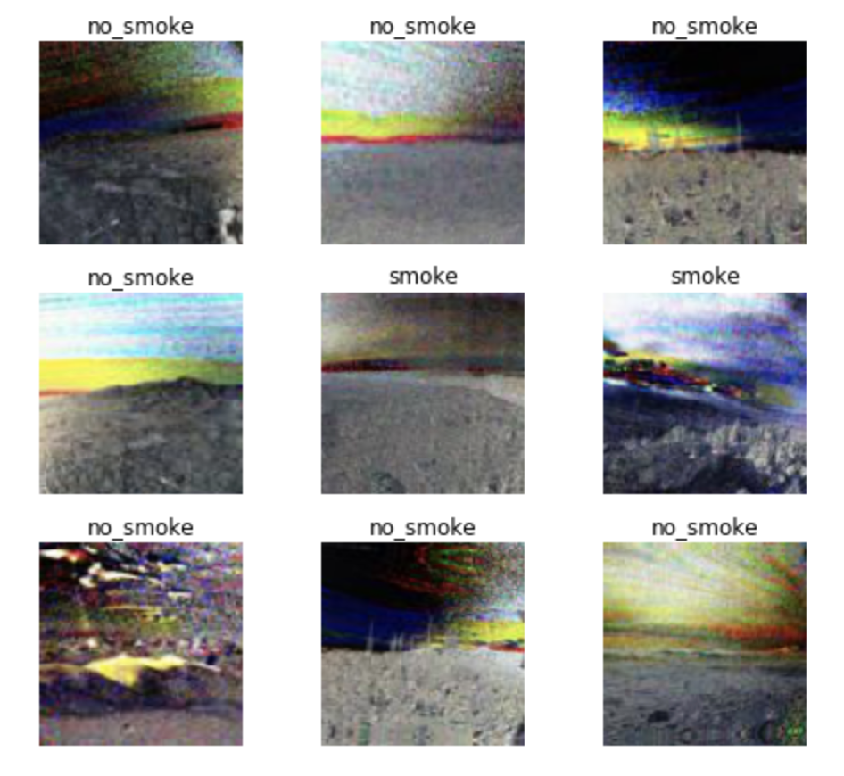

# Let's Stop Wildfires Hackathon

You can find more information on **let's stop wildfires hackathon** in the official [repo]( https://github.com/aiformankind/lets-stop-wildfires-hackathon). I am sharing here the outcomes of this project.

## Preparation

#### First challenge
The first task is to build a classifier to separate images with smoke and images without smoke.  
:point_right: For the moment, I have around 0.142857 error_rate using a simple resnet30 after a lot of epochs.

#### Second challenge
The second task is almost the same: to build a classifier to separate images with smoke and images without smoke. Images are pieces of the images used in the first challenge.  
:point_right: The classifier is faster to train. After a few epochs, the error_rate is around 0.066207.

#### Third challenge
Given a sequence of images, the task is to detect the fire as early as possible.

#### Ideas

The goal of this hackathon is to decrease the number of false positive and to detect fire as early as posssible.  
We found out three ideas to try that take into account a sequence of 2 images as an output of a CNN:
- 2 images difference
- 2 images stacking
- CNN then neural network

## First idea: 2 images difference

The idea is to create a new set of images based on a sequence. Each image is the difference of two images. Calculating the difference of images seems to be a good idea, because:
- we can generate a larger dataset with what we have
- instead of trying to identify signs of fire, the algorithm will try to identify among variation of images what could be a fire
- we think that it can be easier for the algoritm to identify small relevant variations (such as the very beginning of a fire) vs small regular variations (clouds, fogs, sunrise, sunset)

First, we built a dataset. The hackathon organizers provided us a dataset of 23 sequences of images. Because this is not a lot of data, we built a new dataset consisting of a combination of two images.

Rules used to build the new dataset:
- no_smoke(t) + no_smoke(t+1) = no_smoke
- no_smoke(t) + smoke(t+1) = smoke
- smoke(t) + smoke(t+1) = smoke
- no_smoke(t) + smoke_(t+2) = smoke

You can find the new dataset with differences [here](https://drive.google.com/file/d/1aOaHLqR8I_nGA4MiF7TGJgwpXzcjgUNF/view?usp=sharing)

You can find below an extract of images generated with a very small resolution (128x128) because otherwise it would have taken too much disk space.

#### Results

Results are different on the validation set and on the test set.

The validation set is built by taking 20% of the dataset randomly. That means that the algorithm may have seen what is a smoke and a non-smoke image for the same camera. In this case, the accuracy is very good, around 0.010177.

However, results are very different on the test set. The test set is built differently. We use a sequence of images from 2 new cameras. The algorithm has not seen any images fron these 2 new cameras. Results are ok but with a lot of false positives.

On the test set we have the following result:
- for folder 20180704-Benton-hp-n-mobo-c, we detect fire only starting from frame 360 whereas it is detectable from human starting from frame 120
- for folder 20180706-West-lp-n-mobo-c, results are worse, it is detecting fire where there is no fire at all

#### Conclusion

Calculating differences was time and memory consuming to generate only small resolution images. It is sure that results would have been better with bigger images.

It is quite hard for the algorithm to generalize well on a totally new set of images from an unknown camera. However, **results are better when the algorithm already know the non-smoke images of a camera.**

A good idea to try would be to
- train the model on images from different camera
- retrain the model with a smaller learning-rate on non-smoke images from new cameras
By doing this, we are providing the classifier what are the non-smoke conditions of a specific camera.
